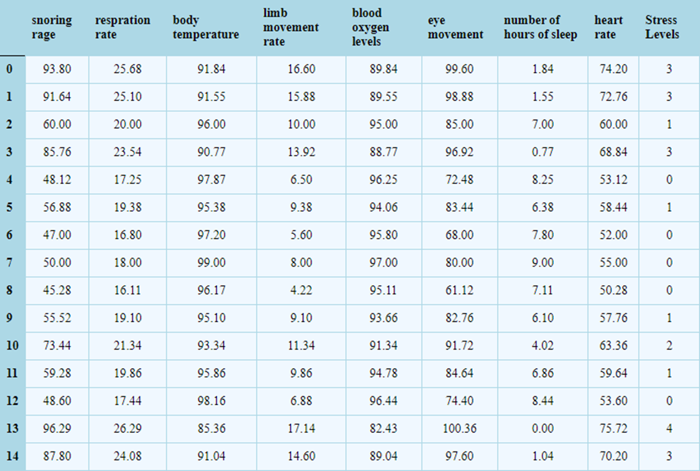
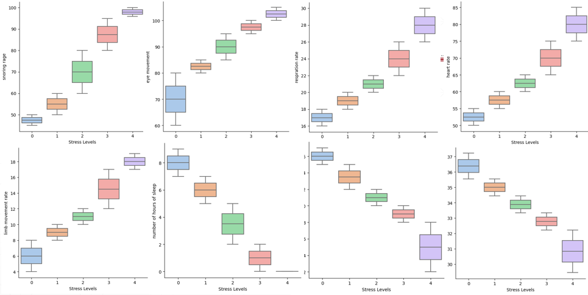
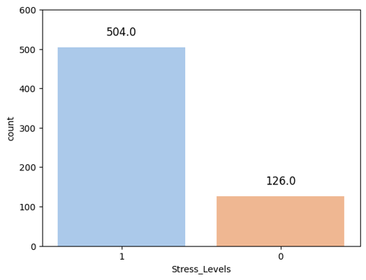
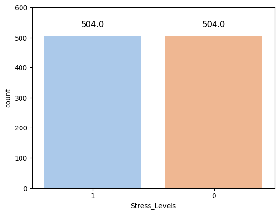
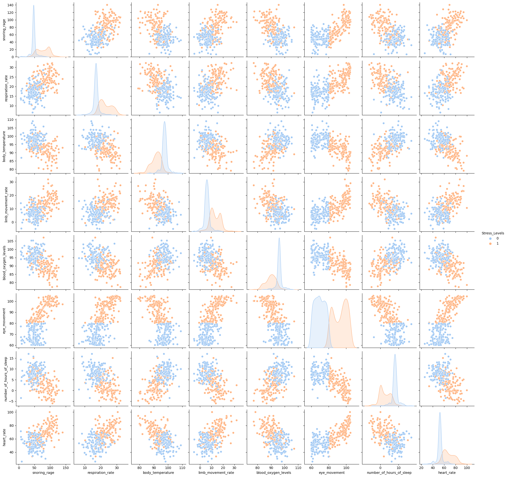
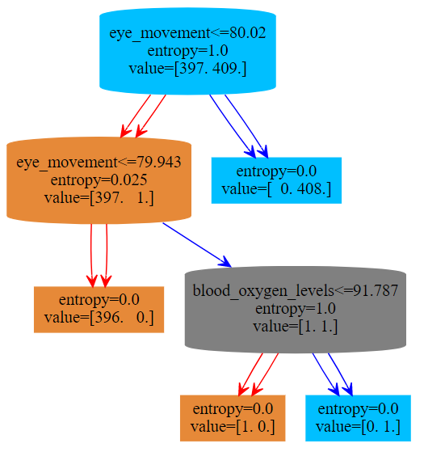

## Project Description

The dataset used throughout the assignment is [Human Stress Detection in and through Sleep](https://www.kaggle.com/datasets/laavanya/human-stress-detection-in-and-through-sleep).

To get insights into the data:

1) [EDA](#eda) was conducted;

2) [Different models](#modelling) were used to predict level of stress as variable dependent on sleep characteristics variables.

3) [Color Decision Tree](#color-dt) was constructed to better visualize the data in the dataset.

## Stack 

<ul>Python libraries used for data visualisation and analysis:

<li>for fitting KNeighbors Classifier Algorithm, Logistic Regression and other models:
</li>

<li>for modelling data:
</li>


<li>for visualizing data:
  
</li>
</ul>

All the graphs used below are reproducable with the code in the dedicated notebooks.

## EDA

Refer to [EDA notebook](https://github.com/bess-cater/Data-Mining-Class/blob/d850eaacc811602b023befe00bd50b5a3e05a83e/EDA.ipynb).

The dataset has 8 predictors (features) and one dependant variable, stress level (from 0 to 4), which is later predicted with different models.



We can see that all the predictors have no outliers and the data can be *very accurately* divided into 5 corresponding levels of stress! *Hmm... Suspicious!* :thinking:



The correlation between the features is also just too good to be true!


## Modelling 

Refer to [modelling notebook](https://github.com/bess-cater/Data-Mining-Class/blob/d850eaacc811602b023befe00bd50b5a3e05a83e/modelling.ipynb).

Now, let's look at the results of the models prediction.

However, first we need some data preprocessing.

1) First, to use binary prediction models, we need to change 5 classes of stress levels into two: to do this, we'll consider level of 0 as no stress, and others - as data samples collected when one was experiencing a certain level of stress.



2) However, now we have imbalance problem... to fix this, we'll modify our data using SMOTE algorithm!



Now everything looks good and we are ready to fit some models... Or not?

Data looks too perfect and there have been [speculations](https://www.kaggle.com/datasets/laavanya/human-stress-detection-in-and-through-sleep/discussion/308789) about it being artificially generated...

Real data collected from users is supposed to be noisy, so let's add some noise to it!

```python
# Example code from a Jupyter Notebook cell
#Two-by-four array of samples from the normal distribution with mean 3 and standard deviation 2.5:
# random_mean = [60, 19.8, 94.5, 9.5, 92, 81, 5.3, 59.9 ]
random_std=[18, 4, 3.6, 4.45, 3.9, 13.6, 3.19, 9.8]
gen_upd=gen.sample(254).index
for col, beta in zip(gen.columns, random_std):
  if col=='eye_movement': continue
  a = beta * np.random.randn(254)
  gen.loc[gen_upd, col]=gen.loc[gen_upd, col]+a

```

I guess it looks more naturally now and there is overlap in predictors!



After this last modification, we fit models...

| Model | Area Under the Curve (AUC) | Class | Precision | Recall | F1-score | Support |
|-------|-----------------------------|-------|-----------|--------|----------|---------|
| **KNN** | 0.9900 | 0 | 0.99 | 0.99 | 0.99 | 93 |
|       |                             | 1 | 0.99 | 0.99 | 0.99 | 109 |
| **NB**  | 0.8791 | 0 | 0.79 | 0.98 | 0.88 | 93 |
|       |                             | 1 | 0.98 | 0.78 | 0.87 | 109 |
| **LR**  | 0.9954 | 0 | 0.99 | 1.00 | 0.99 | 93 |
|       |                             | 1 | 1.00 | 0.99 | 1.00 | 109 |
| **GB**  | 1.0000 | 0 | 1.00 | 1.00 | 1.00 | 93 |
|       |                             | 1 | 1.00 | 1.00 | 1.00 | 109 |

| Accuracy |  | Macro Avg | Precision | Recall | F1-score | Support |
|----------|--|-----------|-----------|--------|----------|---------|
| **KNN**   | 0.99 |         | 0.99 | 0.99 | 0.99 | 202 |
| **NB**    | 0.87 |         | 0.88 | 0.88 | 0.87 | 202 |
| **LR**    | 1.00 |         | 0.99 | 1.00 | 1.00 | 202 |
| **GB**    | 1.00 |         | 1.00 | 1.00 | 1.00 | 202 |

Well, the results are still *suspiciously* still very good!

## Color DT

**DISCLAIMER**: *Color Decision Tree as a concept is not my invention and I do not claim any credit for it.*

Refer to [Color DT notebook](https://github.com/bess-cater/Data-Mining-Class/blob/d850eaacc811602b023befe00bd50b5a3e05a83e/colorDT.ipynb).

Color tree is a Decision tree with a few modifications:

1) Colors of the nodes indicate whether data samples of one or another class dominate the node;

2) Color of the arrows indicate whether proportion of data sample of a corresponding class has increased after partition;

3) Double arrows additionally indicate that Gini Index has increased after partition.

Here is one example of such tree:




